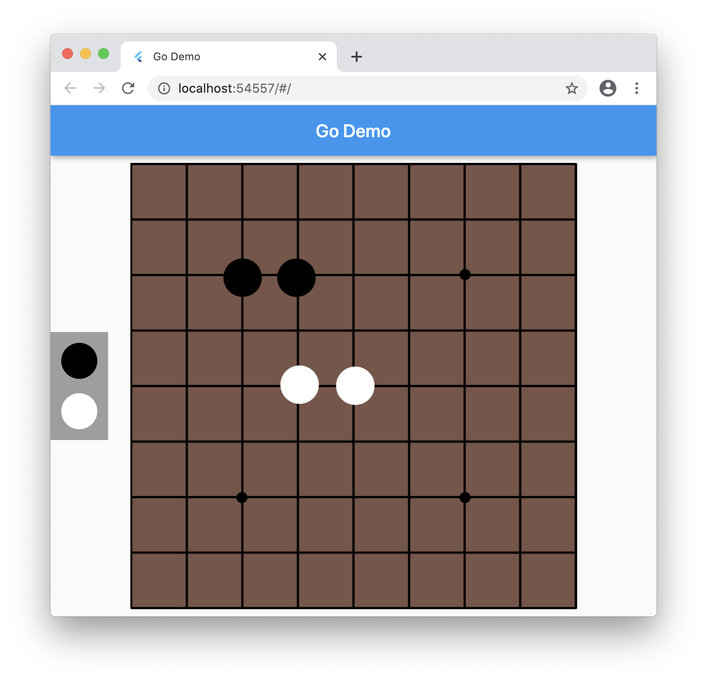

# Go

An example of using [InteractiveViewer](https://master-api.flutter.dev/flutter/widgets/InteractiveViewer-class.html) to build a Go game board.

Try the [live demo](https://justinmc.github.io/flutter-go/).

## Usage
Zoom using pinch on mobile or two-finger scroll on touchpad or scroll wheel on mouse.

Pan using tap and drag or click and drag.

Drag white or black pieces from the left edge of the screen to add pieces using finger or mouse.

Drag pieces around the board using finger or mouse.
